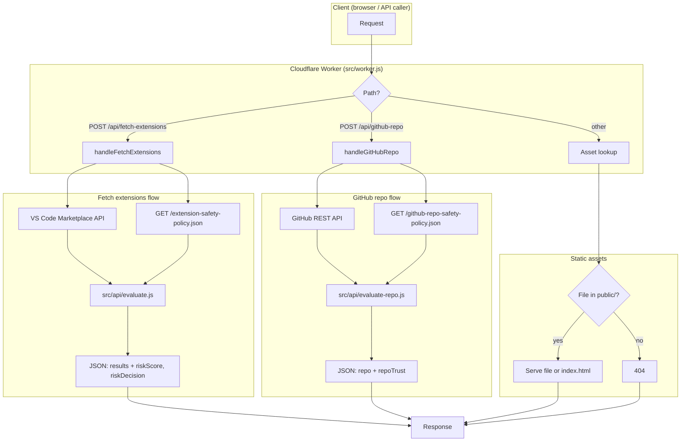

# Architecture

Overview of how the app is built and how requests and data flow.

## Request flow (diagram)

## High-level

- **Single Cloudflare Worker** serves both static assets and API routes.
- **Static assets** (HTML, policy JSONs) live in `public/` and are served at the site root.
- **API routes** are handled by the Worker first (before asset lookup) for paths under `/api/*`.
- **Extension data** comes from the VS Code Marketplace (undocumented public API).
- **Repo data** (for GitHub links) comes from the GitHub REST API.
- **Trust scores** are computed in the Worker using policy JSON files; the same evaluation logic exists in the browser and in Node for tests/CI.

## Request flow

1. **Incoming request** → Worker `fetch()` handler.
2. **Path**:
   - `/api/fetch-extensions` (POST) → `handleFetchExtensions(request)` → Marketplace + policy → evaluate → JSON response.
   - `/api/github-repo` (POST) → `handleGitHubRepo(request, env, origin)` → GitHub API + policy → evaluate → JSON response.
   - Any other path → Asset lookup: if a file in `public/` matches (or SPA fallback to `index.html`), serve it; else 404.
3. **Assets** are served by the Workers runtime from the configured `directory`; the Worker script does not serve them directly.

## Data sources

| Data | Source | Used by |
|------|--------|--------|
| Extension metadata (publisher, version, dates, rating, installs, repo link) | VS Code Marketplace `extensionquery` API | `src/api/fetch-extensions.js` |
| Extension safety policy | `public/extension-safety-policy.json` (same origin) | `src/api/evaluate.js`, browser, `lib/evaluate-extension.js` |
| GitHub repo metadata (stars, forks, issues, PRs, activity, contributors) | GitHub REST API (`/repos/{owner}/{repo}`, pulls, contributors) | `src/api/github-repo.js` |
| GitHub repo safety policy | `public/github-repo-safety-policy.json` (same origin) | `src/api/evaluate-repo.js`, `lib/evaluate-repo-extension.js` |

## Key modules

| File | Role |
|------|------|
| `src/worker.js` | Entrypoint; routes by path and method; passes `env` to handlers that need it (e.g. `GITHUB_TOKEN`). |
| `src/api/fetch-extensions.js` | Builds Marketplace request, parses response, extracts repo URL and `hasPublicRepo`, loads extension policy, runs `evaluateExtension`, returns results. |
| `src/api/evaluate.js` | Pure function `evaluateExtension(metadata, policy)` → `{ score, decision, triggeredRules, triggeredWithPoints }`. |
| `src/api/github-repo.js` | `parseGitHubRepoUrl`, `getGitHubRepoData(repoUrl, env)` – calls GitHub API, returns normalized repo object. |
| `src/api/github-repo-handler.js` | Parses body for `repoUrl`, calls `getGitHubRepoData`, loads repo policy, runs `evaluateRepo`, returns `{ repo, repoTrust }`. |
| `src/api/evaluate-repo.js` | Pure function `evaluateRepo(metadata, policy)` → same shape as extension evaluation. |
| `public/index.html` | Single-page UI: extension list, fetch, table, risk breakdown; contains inlined `evaluateExtension` for fallback when API doesn’t return trust. |
| `lib/evaluate-extension.js`, `lib/evaluate-repo-extension.js` | CommonJS copies of the evaluators for Node (tests, CI). |

## Limits and constraints

- **Cloudflare Workers** free tier: 50 subrequests per request. Hence max 24 extensions per `POST /api/fetch-extensions` (1 policy + up to 24 Marketplace queries + up to 24 manifest fetches when repo URL is read from package.json).
- **GitHub API** unauthenticated: 60 requests/hour. Set `GITHUB_TOKEN` in Worker env for higher limits.
- **Marketplace** has no documented rate limit; we use a single batch of up to 24 extension lookups per API call (plus optional manifest fetch per extension for repository URL).

## Static assets and SPA

- `wrangler.toml` sets `not_found_handling = "single-page-application"` so unknown paths can fall back to `index.html`.
- `run_worker_first = ["/api/*"]` ensures `/api/*` is always handled by the Worker, not by asset lookup.
